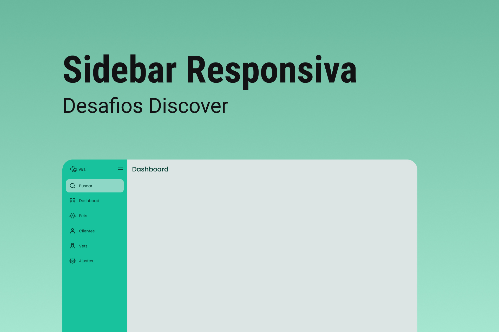

<h1 align="center"> Sidebar </h1>

 

  

## 🚀 Tecnologias

Esse projeto foi desenvolvido com as seguintes tecnologias:

- HTML e CSS
- JavaScript
- Git e Github
- Figma

## 💻 Projeto

O Sidebar é uma barra que traz várias informações que podem melhorar a usabilidade do blog para os leitores, linkando as principais páginas e categorias.

- [Acesse o projeto finalizado, online](https://LKaua22k.github.io/Sidebar)

## 📝 Licença

Esse projeto está sob a licença MIT.

---

Feito com ♥ by Kauã :wave:
